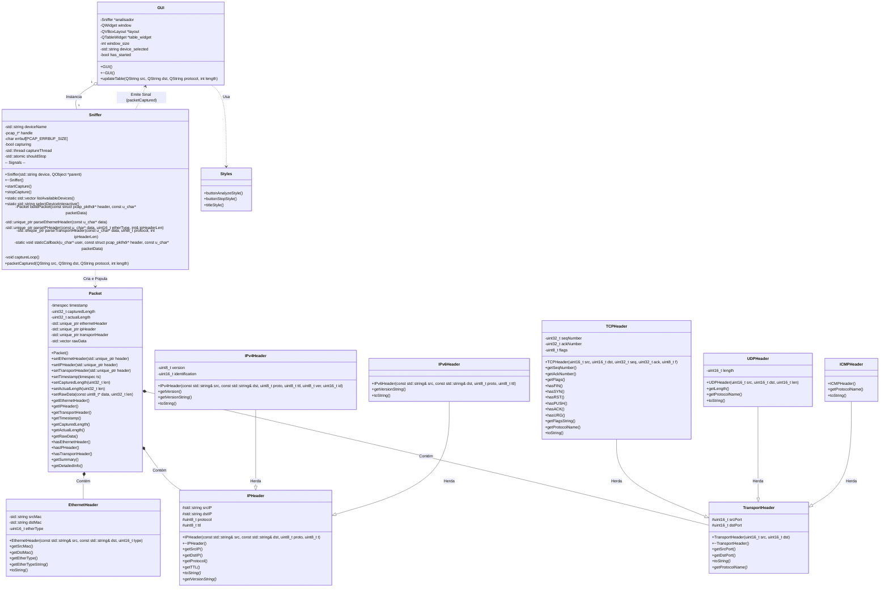

# FioTubarão - Analisador de Tráfego de Rede

O **FioTubarão** é um *Sniffer* de pacotes de rede desenvolvido em C++ moderno (C++17), utilizando o framework Qt 6 para a interface gráfica. O software captura, decodifica e visualiza o tráfego de rede em tempo real, aplicando conceitos de Orientação a Objetos, Gerenciamento de Memória e Concorrência.

**Disciplina:** Programação Orientada a Objetos

**Autor:** Bryan Pinheiro de Souza - bryanpinheiro@unisantos.br;

**Autor:** Fernando Costa Okada Ferreira - fernandocosta@unisantos.br;

**Autor:** Lucas Athayde - lucas.athayde@unisantos.br;

## Arquitetura do Sistema

O projeto adota uma arquitetura orientada a eventos, separando a lógica de captura (pcap) da interface de apresentação (Qt framework).

### Diagrama de Classes e Fluxo



### Detalhamento dos Módulos (OOP)

#### 1\. Entry Point (`main.cpp`)

Responsável pelo **Bootstrap** da aplicação. Implementa um mecanismo de auto-elevação de privilégios:

  - Verifica o UID do processo (`getuid()`).
  - Caso não seja *root*, reinicia a aplicação utilizando `pkexec` (Linux), preservando variáveis de ambiente gráfico como `DISPLAY`.

#### 2\. Controlador de Captura (`sniffer.hpp` / `.cpp`)

Atua como um **Wrapper** orientado a objetos sobre a biblioteca `libpcap`.

  - **Multithreading:** Executa o loop de captura (`pcap_loop`) em uma `std::thread` dedicada, evitando o congelamento da interface gráfica.
  - **Sinais e Slots:** Herda de `QObject` para emitir **sinais assíncronos** (`packetCaptured`) à GUI sempre que um pacote é processado.
  - **Parsing:** Contém a lógica de conversão de dados brutos (`u_char*`) para objetos estruturados.

#### 3\. Modelo de Dados (`packet.hpp` / `.cpp`)

Representa a entidade do pacote capturado, utilizando **Polimorfismo** e **Composição** para mapear as camadas do Modelo OSI:

  - **Gerenciamento de Memória:** Utiliza `std::unique_ptr` para garantir que a memória dos cabeçalhos (Ethernet, IPv4, TCP/UDP) seja alocada e liberada automaticamente.
  - **Abstração:** Classes base abstratas (`IPHeader`, `TransportHeader`) permitem tratamento genérico de diferentes protocolos (ex: TCP e UDP herdam de TransportHeader).

#### 4\. Interface Gráfica (`gui.hpp` / `.cpp`)

Desenvolvida com o framework **Qt6**.

  - **Slots:** O método `updateTable` recebe os dados da thread de captura e atualiza a `QTableWidget` de forma thread-safe (o Qt gerencia a fila de eventos entre threads).

-----

## Requisitos de Sistema

  * **Linguagem:** C++17
  * **Framework:** Qt 6 (Componente Widgets)
  * **Build System:** CMake 3.10+
  * **Bibliotecas de Captura:**
      * **Linux:** `libpcap`
      * **Windows:** `Npcap`

### Instalação das Dependências (Debian/Ubuntu/WSL)

```bash
sudo apt update
sudo apt install -y build-essential g++ cmake pkg-config
sudo apt install -y libpcap-dev
sudo apt install -y qt6-base-dev libgl1-mesa-dev libxkbcommon-dev
```

-----

## Compilação e Build

Este projeto utiliza **CMake Presets** para simplificar a configuração em diferentes ambientes.

### Linux / WSL

```bash
# 1. Configurar o projeto (Gera os Makefiles)
cmake --preset linux-debug

# 2. Compilar o binário
cmake --build --preset linux-debug
```

### Windows (Visual Studio 2022)

```bash
cmake --preset windows-debug
cmake --build --preset windows-debug
```

-----

## Como Executar

O executável final é gerado dentro da pasta `out/build`. A captura de pacotes exige acesso direto à placa de rede, portanto, **privilégios de administrador são necessários**.

```bash
# Executar no Linux/WSL
sudo ./out/build/linux-debug/PacketSniffer
```
-----

## Estrutura de Arquivos

  * `src/main.cpp`: Ponto de entrada, checagem de root e inicialização do Qt.
  * `src/sniffer.cpp`: Lógica de conexão com o hardware de rede e loop de captura.
  * `src/packet.cpp`: Definição das classes de cabeçalhos (Ethernet, IP, TCP, UDP) e formatação de strings.
  * `src/gui.cpp`: Construção da janela, tabela e botões.
  * `src/styles.hpp`: Definições de CSS (Qt Style Sheets) para a interface.
  * `CMakeLists.txt`: Script de configuração de compilação, embora testado somente no linux.

-----
